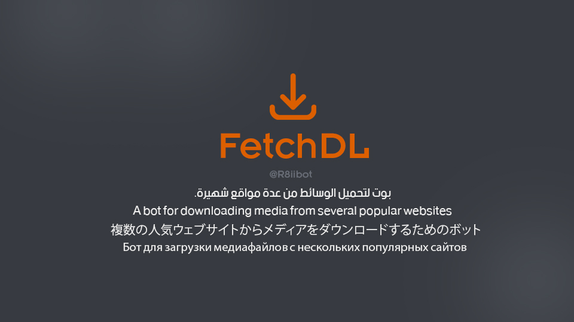
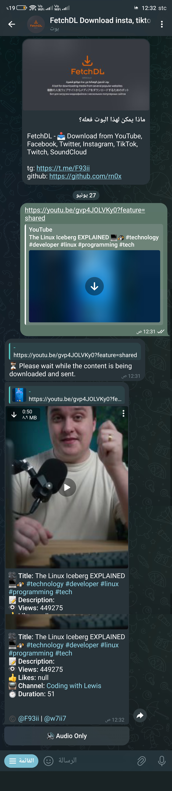
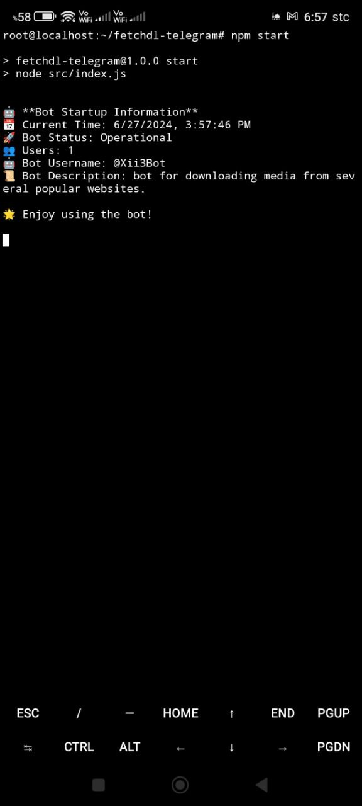

# FetchDL-Telegram

FetchDL - 📥 Download media from YouTube, Facebook, Twitter, Instagram, TikTok, Twitch, SoundCloud

<div align="center">

 <br><br>

 <br><br>


</div>

## Description
FetchDL-Telegram is a Telegram bot designed to download media content from various popular platforms such as YouTube, Facebook, Twitter, Instagram, TikTok, Twitch, and SoundCloud. It provides a convenient way for users to fetch and share media content directly through Telegram.

## Requirements
To run FetchDL-Telegram, you need to have the following installed:
1. **Node.js** - JavaScript runtime environment.

## Installation
To install FetchDL-Telegram, follow these steps:
1. Clone the repository from GitHub:
   ```bash
   git clone https://github.com/rn0x/fetchdl-telegram.git
   ```
2. Navigate into the project directory:
   ```bash
   cd fetchdl-telegram
   ```
3. Install dependencies using npm:
   ```bash
   npm install
   ```

## Configuration
1. Create a `.env` file in the root directory of the project.
2. Add your Telegram bot token (`TELEGRAM_TOKEN`) to the `.env` file:
   ```
   TELEGRAM_TOKEN=your_telegram_bot_token_here
   ```

## Running the Bot
To run FetchDL-Telegram:
```bash
npm start
```
This command starts the bot and initializes it to listen for incoming messages and commands on Telegram.

<div align="center">

 <br><br>


</div>

## Dependencies
FetchDL-Telegram uses the following npm packages:
```json
"dependencies": {
  "better-sqlite3": "^11.0.0",
  "dotenv": "^16.4.5",
  "downlib": "^1.2.1",
  "telegraf": "^4.16.3"
},
"devDependencies": {
  "nodemon": "^3.1.4"
}
```
- **better-sqlite3**: SQLite database library for Node.js.
- **dotenv**: Module to load environment variables from a `.env` file.
- **downlib**: Library for downloading media from various platforms.
- **telegraf**: Telegram bot framework for Node.js.


## Termux 

<div align="center">

 <br><br>

</div>

```
You can run the bot on Android devices using the Termux app 📱. Follow these steps:

1. Install proot-distro:
   pkg install proot-distro

2. Install Debian distribution:
   proot-distro install debian

3. List available Linux distributions:
   proot-distro list

4. Log in to the Debian distribution:
   proot-distro login debian

After logging into proot-distro, you can use commands as you would on a regular Linux system 🖥️.

To install FetchDL-Telegram, follow these steps:

1. Install git, Node.js, and npm:
   apt update
   apt install git nodejs npm

2. Clone the repository from GitHub:
   git clone https://github.com/rn0x/fetchdl-telegram.git

3. Navigate into the project directory:
   cd fetchdl-telegram

4. Install dependencies using npm:
   npm install


This way, you can easily run the bot on your Android device using Termux! 🚀
```

## License
This project is licensed under the GNU General Public License v3.0 - see the LICENSE file for details.